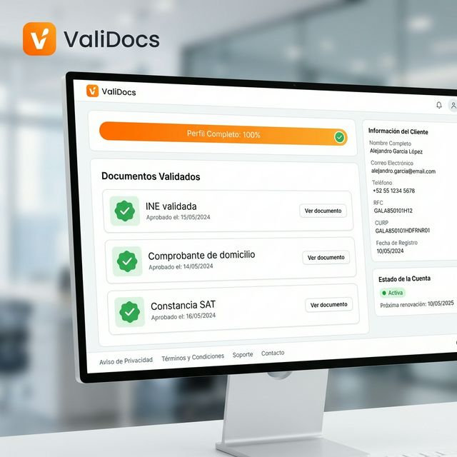
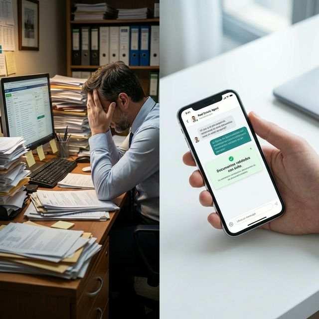
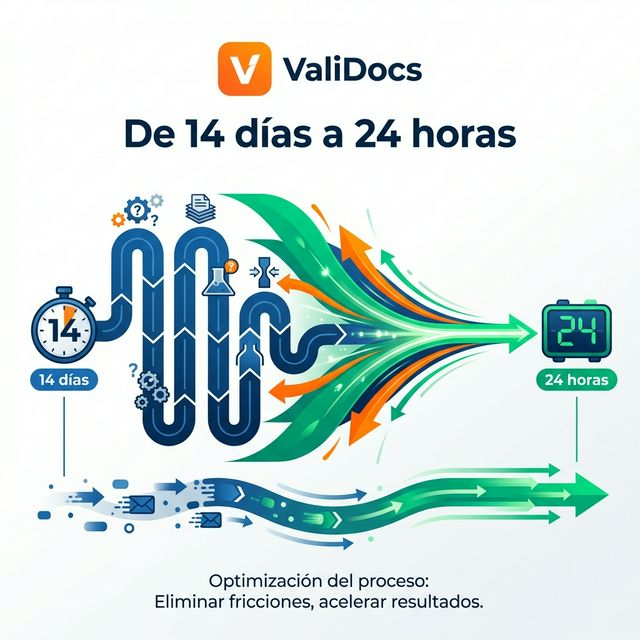
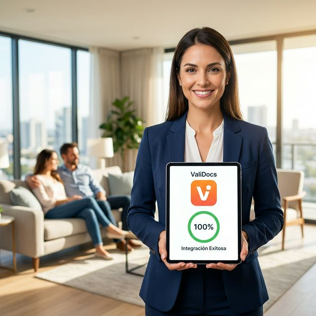
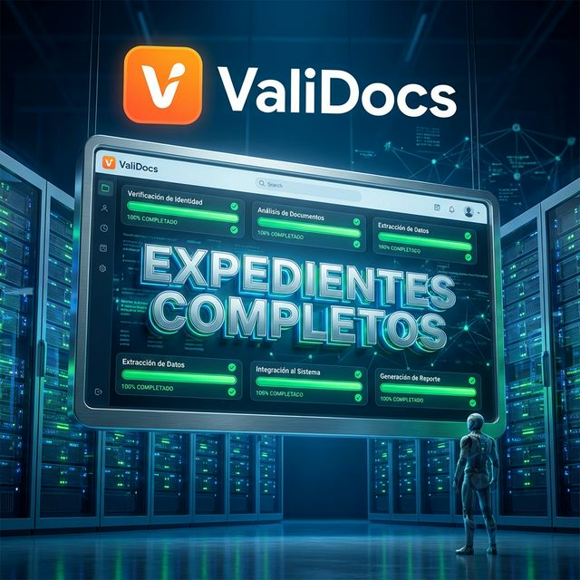
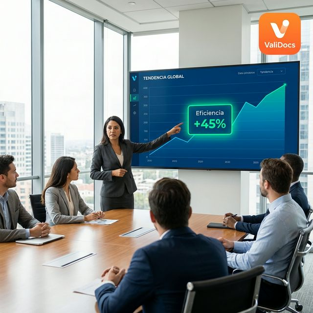
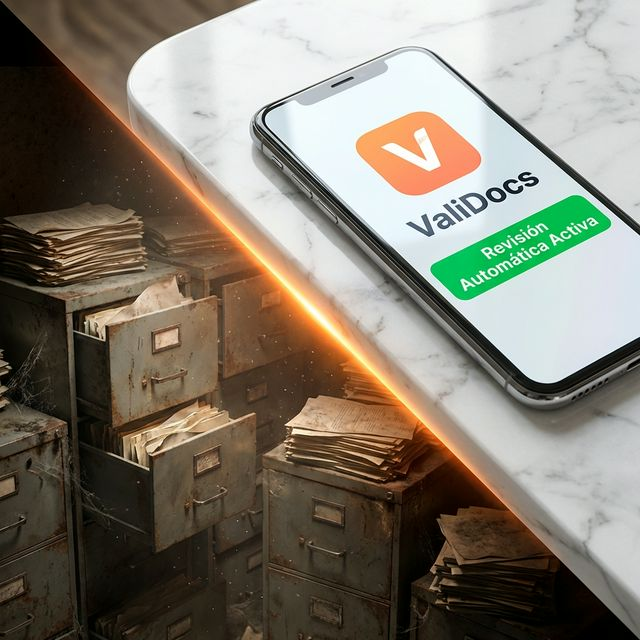
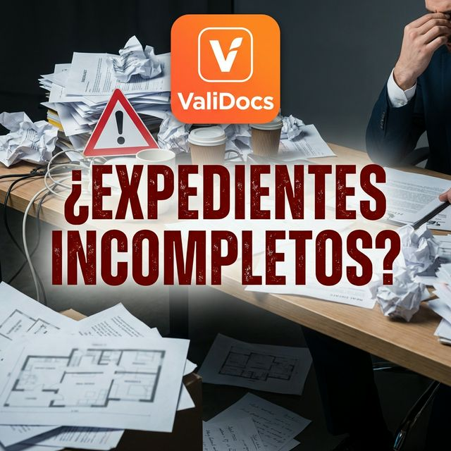
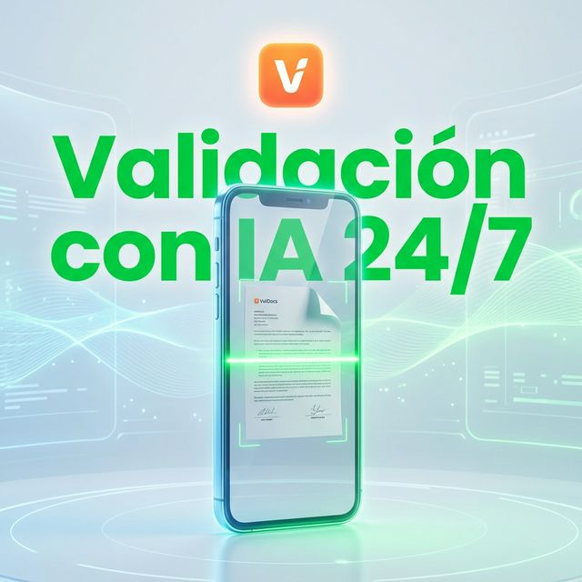
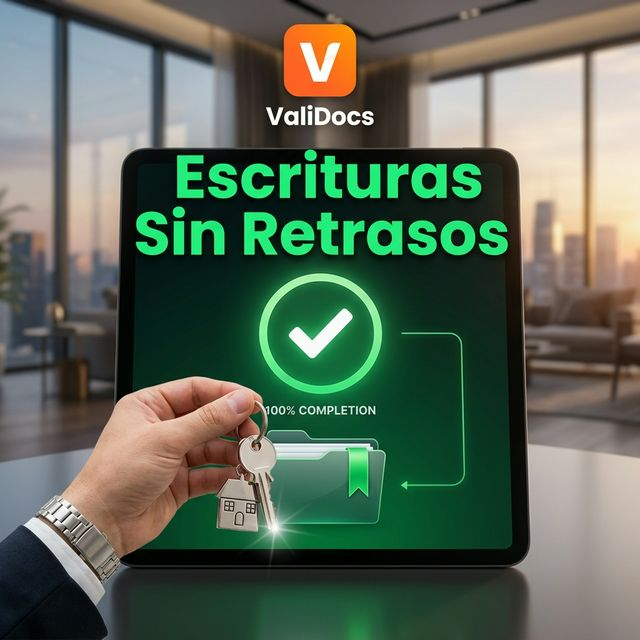

[⬅️ Return to Home](./)

# Meta Marketing Strategy V2: Automated Document Collection Platform

**Target Audience:** Decision makers at real estate companies in Mexico (e.g., Vinte Viviendas Integrales).
**Campaign Purpose:** Generate leads (Book a demo).

## Phase 1: Strategy Design

**Primary Language:** Spanish (Localized for Mexico B2B Real Estate)

**Campaign Strategy & Structure:**
We will implement a simplified, modern campaign structure heavily reliant on Meta's machine learning to find the right decision-makers. Since we want to generate B2B software leads, our objective is **Lead Generation (Conversions)** optimizing for the "Book a demo" event on your landing page.

*   **Campaign Objective:** Leads (Website Conversions)
*   **Budget Strategy:** Campaign Budget Optimization (CBO) to let Meta distribute the budget to the best-performing creatives and audiences, exiting the learning phase faster.
*   **Targeting:** 
    *   **Core Audience:** Advantage+ Audience with a broad age range (28-60) covering all of Mexico.
    *   **Audience Suggestions (Signals):** To give the algorithm a starting point, we will input broad B2B signals such as "Bienes raíces", "Desarrollo inmobiliario", "Director ejecutivo", and "Gerente de ventas". However, we will allow Meta to expand beyond these specific interests if it finds conversions elsewhere.
*   **Placements:** Advantage+ Placements (Automatic) to ensure we reach decision-makers wherever they are spending their time across Facebook, Instagram, and the Audience Network.

## Phase 2: Ad Creative Generation (The 4 Angles)

In current media buying, creative is the new targeting. We will use a mix of 4 distinct angles to feed the Advantage+ algorithm and speak to different avatars within Real Estate developers.

### Angle 1: Speed of Closing (Sales & Cash Flow)

#### Concept 1.1: Dashboard UI

*   **Visual Concept:** A clean, modern, and professional SaaS software UI mockup of a customer profile dashboard. It features a prominent progress bar filled to 100% with the text accurately reading 'Perfil Completo: 100%'. Below it, a section titled 'Documentos Validados' showing a list of realistically named Mexican legal documents with green checkmarks indicating approval.
*   **The Hook (Image Text):** Deja de perseguir clientes por documentos.
*   **Primary Text:** Validar expedientes de compradores toma demasiado tiempo y retrasa tus escrituras. Nuestra plataforma automatiza la recolección por correo y WhatsApp, analiza la vigencia de cada archivo con Inteligencia Artificial y notifica a tu equipo comercial en tiempo real. Se integra a tu CRM en minutos (Salesforce, Hubspot, etc.) para que no cambies tu forma de trabajar. Cierra ventas más rápido sin perder el control del proceso.
*   **Headline:** Deja de perder cierres por papeleo lento.
*   **Call to Action (CTA):** Solicitar demostración

#### Concept 1.2: Split Screen Contrast

*   **Visual Concept:** A split-screen composition showing a stark contrast. On the left: a cluttered office desk overflowing with stacks of printed papers, with a stressed real estate sales advisor. On the right: a clean, minimalist setup featuring a modern smartphone screen displaying a neat mobile chat interface for 'ValiDocs', with a success notification.
*   **The Hook (Image Text):** Tus asesores son para vender, no para cobrar papeles.
*   **Primary Text:** El proceso de integración de crédito no debe ser un dolor de cabeza. Libera a tu equipo de ventas de la carga administrativa y ofrécele a tus compradores una experiencia impecable donde no tienen que ir a dejar copias físicas a la oficina. Nuestro sistema pide, valida y aprueba los documentos directamente por WhatsApp y Email.
*   **Headline:** Acelera tus cierres de venta inmobiliarios.
*   **Call to Action (CTA):** Conoce cómo funciona

#### Concept 1.3: ROI Timeline

*   **Visual Concept:** A sleek, minimalist infographic style image showing a timeline compressing drastically, illustrating a massive reduction in time from '14 días' to '24 horas'. The design is clean, corporate, and modern, representing the elimination of friction in a business process.
*   **The Hook (Image Text):** Integra expedientes completos en tiempo récord.
*   **Primary Text:** Las desarrolladoras inmobiliarias pierden semanas revisando identificaciones y comprobantes a mano para cada nuevo contrato. Descubre cómo nuestra herramienta automatizada audita documentos bajo la normativa mexicana de forma segura, reduciendo el tiempo de REVISIÓN a solo 24 horas. Elimina el estatus de "esperando al cliente".
*   **Headline:** Escritura en tiempo récord: Conoce la metodología.
*   **Call to Action (CTA):** Reservar cita

### Angle 2: Buyer Experience (Focus on Proptech & Innovation)

#### Concept 2.1: Lifestyle / Frictionless Buying (The Happy Buyer Angle)

*   **Visual Concept:** A high-quality photorealistic lifestyle shot of a happy young Mexican couple sitting on a modern sofa in a new house. They look relieved and excited while looking at a smartphone. The phone clearly displays the "ValiDocs" app with a green success bubble reading "¡Tu casa te espera!". A subtle top banner reads "Software exclusivo para Desarrolladoras" to clearly frame this as a B2B product, avoiding confusion with B2C real estate listings.
*   **The Hook (Image Text):** Comprar casa debería ser emocionante, no un dolor de cabeza documental.
*   **Primary Text:** Entregar papeles interminables arruina la experiencia de compra de tus clientes. Ofrece un proceso moderno, transparente y 100% digital. Con ValiDocs, tus compradores suben sus requisitos desde su celular en minutos y tú cierras operaciones en tiempo récord. Mejora tu reputación y aumenta tus referidos.
*   **Headline:** La experiencia de compra Proptech que tus clientes exigen.
*   **Call to Action (CTA):** Ver demostración

#### Concept 2.2: Authority / Operational Efficiency (The Seamless Agent Angle)

*   **Visual Concept:** A professional real estate agent standing confidently in a bright modern property. They hold a digital tablet showing the "ValiDocs" dashboard with a 100% progress circle and the text "Integración Exitosa". The client is visible in the background, relaxed.
*   **The Hook (Image Text):** Dale a tus asesores la herramienta para cerrar más rápido.
*   **Primary Text:** Los asesores exitosos de hoy usan tecnología para eliminar fricción, no para archivar papeles. Automatiza la recolección KYC y la integración del expediente crediticio. Tus asesores no necesitan capacitarse, el sistema hace el trabajo por ellos vía WhatsApp. Tu equipo de ventas proyectará profesionalismo y eficiencia, reduciendo el ciclo de venta a la mitad.
*   **Headline:** Tecnología para Asesores Inmobiliarios Top.
*   **Call to Action (CTA):** Reservar cita

#### Concept 2.3: Concept / The Future of Integration (The Tech Angle)

*   **Visual Concept:** A sleek, conceptual 3D abstract composition showing a modern architectural building model. Hovering above it are clean digital UI components from "ValiDocs", showing documents flowing smoothly into a secure automated system. 
*   **The Hook (Image Text):** El estándar de validación documental para desarrolladoras líderes.
*   **Primary Text:** Incorpora innovación real en tu proceso operativo. Evita multas por incumplimiento de protección de datos gracias a nuestra infraestructura cloud segura. ValiDocs es la infraestructura tecnológica de validación en la nube diseñada para el mercado inmobiliario mexicano. Seguridad de grado bancario, validación de INE por IA y control total del expediente del cliente.
*   **Headline:** Actualiza tu proceso de escrituración hoy.
*   **Call to Action (CTA):** Más información

### Angle 3: Scalability & Operational Load Reduction (Focus on Admin/COO)

#### Concept 3.1: Metaphorical / The Scaling Machine (The Control Tower Angle)

*   **Visual Concept:** A high-end 3D illustration of an incredibly organized, futuristic control room or a large glowing dashboard. The dashboard screen prominently displays the "ValiDocs" app interface with multiple glowing progress bars all reaching 100%. The text clearly reads: "Expedientes Completos".
*   **The Hook (Image Text):** Domina el volumen de ventas sin colapsar tu equipo.
*   **Primary Text:** Cada nuevo proyecto inmobiliario multiplica el caos administrativo. Integra expedientes de cientos de compradores sin contratar más personal operativo. ValiDocs es la infraestructura tecnológica de validación documental que te permite escalar tu volumen de escrituración sin límites. Implementación en 5 días sin necesidad de equipo técnico o ingenieros.
*   **Headline:** Automatización para operaciones inmobiliarias a escala.
*   **Call to Action (CTA):** Más información

#### Concept 3.2: Professional Lifestyle (Boardroom Analytics Angle)

*   **Visual Concept:** A sleek image inside a sunlit, modern boardroom. A Chief Operating Officer (COO) or Operations Director is standing and pointing at a large digital presentation screen. The screen shows the "ValiDocs" dashboard showcasing an analytics chart and explicitly reading "Eficiencia +45%".
*   **The Hook (Image Text):** Tus mejores cierres comienzan en la operación, no en las ventas.
*   **Primary Text:** Los cuellos de botella en la recolección de documentos retrasan tus metas financieras trimestrales. Obtén visibilidad en tiempo real del estatus de cada cliente. Elimina revisiones manuales, ahorra cientos de horas-hombre al mes y prevén multas auditando expedientes bajo las normativas vigentes en minutos, no en días.
*   **Headline:** Eficiencia Documental para Inmobiliarias Líderes.
*   **Call to Action (CTA):** Ver demostración

#### Concept 3.3: Direct Contrast (Operations Automation Angle)

*   **Visual Concept:** A clean composition showing an elegant, modern smartphone on a marble table holding the "ValiDocs" app. The smartphone clearly displays a list of incoming documents automatically categorizing themselves, with a green success banner that accurately reads "Revisión Automática Activa". Next to the phone, an outdated, massive paper filing cabinet rests, covered in a "Cerrado" (Closed) sign.
*   **The Hook (Image Text):** El archivo muerto ahora es digital e inteligente.
*   **Primary Text:** Olvídate del archivero físico y de las interminables cadenas de correo electrónico para recopilar identificaciones y actas. Pasa al siglo XXI con inteligencia artificial que solicita, lee y aprueba automáticamente los requisitos legales de tus compradores 24/7. Totalmente validado y aceptado para procesos de escrituración ante Notario Público en México.
*   **Headline:** El sistema de gestión documental del futuro.
*   **Call to Action (CTA):** Solicitar demostración

### Angle 4: Social Proof & Authority (Carousel of the Process Workflow)

#### Concept 4.1: Card 1 (The Problem)

*   **Visual Concept:** The first card of a carousel showing a chaotic, stressful scenario. A desk overflowing with mismatched, poorly printed papers and a red warning sign. The top of the image features the app logo explicitly named 'ValiDocs'. A bold, dark red text overlay perfectly reads '¿Expedientes Incompletos?'.
*   **The Hook (Carousel First Card Text):** Diseñado para alto volumen de ventas.
*   **Primary Text:** La plataforma definitiva para empresas de desarrollo y comercialización de vivienda. Olvídate de los expedientes incompletos que frenan tus ingresos. Control centralizado, notificaciones automáticas al cliente final y validación inteligente respaldada por inteligencia artificial.
*   **Headline:** Centraliza los documentos de tus compradores.
*   **Call to Action (CTA):** Más información

#### Concept 4.2: Card 2 (The Solution)

*   **Visual Concept:** The second card of the carousel illustrating the solution. A neat, glowing 3D smartphone showing a document cleanly scanning with a glowing green horizontal laser line. The top features the 'ValiDocs' logo. Bright green text overlay reads 'Validación con IA 24/7'.
*   **Headline:** Tecnología que trabaja por ti.

#### Concept 4.3: Card 3 (The Result)

*   **Visual Concept:** The final card of the carousel showing the ultimate benefit. A sleek, modern dashboard glowing green with a 100% completion graphic and a prominent checkmark. A businessperson's hand holds the keys to a house. The top features the 'ValiDocs' logo. Bright green text overlay reads 'Escrituras Sin Retrasos'.
*   **Headline:** Control total de la operación.

## Phase 3: Optimization Guidance

To ensure this strategy is successfully executed, you must focus on the following optimization principles:

1.  **Robust Tracking Infrastructure:** Before spending a single peso, ensure the Meta Pixel and Conversions API (CAPI) are correctly installed on your landing page and calendar booking software. Signal quality is the lifeblood of Advantage+ campaigns. Meta needs to know exactly who is booking a demo to find more people like them.
2.  **Key Metrics to Monitor:**
    *   **Cost Per Action (CPA):** Your ultimate source of truth is your Cost Per Demo Booked.
    *   **Thumb-stop Ratio (3-second views / Impressions):** If this metric is low (below 25%), your visual hook is failing to grab the attention of the real estate decision-makers. You need to test new image designs before changing the copy.
    *   **Outbound CTR (Click-Through Rate):** If people are stopping to look but not clicking (below 1%), your Primary Text or Headline is not compelling enough, or the offer (Book a demo) feels like too much friction.
    *   **Landing Page Conversion Rate:** If CTR is high but CPA is high, the disconnect is happening on your website. Ensure the landing page messaging perfectly matches the promise made in the ad.
3.  **Creative Fatigue:** You are launching with 4 diverse concepts across dozens of variations. Let them run for at least 3-5 days without touching them to exit the learning phase. Once you identify the winning angle, iterate continuously on that specific concept (new colors, slightly different hook text, different UI mockups) while turning off the losers.
